# 02.2 Network Infrastructure & Security (โครงสร้างเครือข่ายและความปลอดภัย)

---

title: 'Network Infrastructure'
version: 1.8.0
status: first-draft
owner: Nattanin Peancharoen
last_updated: 2026-02-23
related:
  - specs/02-Architecture/00-01-system-context.md

---

## 1. 🌐 Network Configuration Details

### 1.1 VLAN Networks
| VLAN ID | Name   | Purpose   | Gateway/Subnet  | DHCP | IP Range           | DNS     | Lease Time | Notes           |
| ------- | ------ | --------- | --------------- | ---- | ------------------ | ------- | ---------- | --------------- |
| 10      | SERVER | Interface | 192.168.10.1/24 | No   | -                  | Custom  | -          | Static servers  |
| 20      | MGMT   | Interface | 192.168.20.1/24 | No   | -                  | Custom  | -          | Management only |
| 30      | USER   | Interface | 192.168.30.1/24 | Yes  | 192.168.30.10-254  | Auto    | 7 Days     | User devices    |
| 40      | CCTV   | Interface | 192.168.40.1/24 | Yes  | 192.168.40.100-150 | Auto    | 7 Days     | CCTV & NVR      |
| 50      | VOICE  | Interface | 192.168.50.1/24 | Yes  | 192.168.50.201-250 | Auto    | 7 Days     | IP Phones       |
| 60      | DMZ    | Interface | 192.168.60.1/24 | No   | -                  | 1.1.1.1 | -          | Public services |
| 70      | GUEST  | Interface | 192.168.70.1/24 | Yes  | 192.168.70.200-250 | Auto    | 1 Day      | Guest           |

### 1.2 Switch Profiles
| Profile Name     | Native Network | Tagged Networks       | Untagged Networks | Usage                   |
| ---------------- | -------------- | --------------------- | ----------------- | ----------------------- |
| 01_CORE_TRUNK    | MGMT (20)      | 10,30,40,50,60,70     | MGMT (20)         | Router & switch uplinks |
| 02_MGMT_ONLY     | MGMT (20)      | MGMT (20)             | -                 | Management only         |
| 03_SERVER_ACCESS | SERVER (10)    | MGMT (20)             | SERVER (10)       | QNAP / ASUSTOR          |
| 04_CCTV_ACCESS   | CCTV (40)      | -                     | CCTV (40)         | CCTV cameras            |
| 05_USER_ACCESS   | USER (30)      | -                     | USER (30)         | PC / Printer            |
| 06_AP_TRUNK      | MGMT (20)      | USER (30), GUEST (70) | MGMT (20)         | EAP610 Access Points    |
| 07_VOICE_ACCESS  | USER (30)      | VOICE (50)            | USER (30)         | IP Phones               |

### 1.3 NAS NIC Bonding Configuration
| Device  | Bonding Mode        | Member Ports | VLAN Mode | Tagged VLAN | IP Address      | Gateway      | Notes                  |
| ------- | ------------------- | ------------ | --------- | ----------- | --------------- | ------------ | ---------------------- |
| QNAP    | IEEE 802.3ad (LACP) | Adapter 1, 2 | Untagged  | 10 (SERVER) | 192.168.10.8/24 | 192.168.10.1 | Primary NAS for DMS    |
| ASUSTOR | IEEE 802.3ad (LACP) | Port 1, 2    | Untagged  | 10 (SERVER) | 192.168.10.9/24 | 192.168.10.1 | Backup / Secondary NAS |

> **หมายเหตุ**: NAS ทั้งสองตัวใช้ LACP bonding เพื่อเพิ่ม bandwidth และ redundancy โดยต้อง config ให้ตรงกับ Switch

## 2. 🛡️ Network ACLs & Firewall Rules

### 2.1 Gateway ACL (ER7206 Firewall Rules)
*Inter-VLAN Routing Policy*
| #   | Name              | Source          | Destination      | Service        | Action | Log | Notes                       |
| --- | ----------------- | --------------- | ---------------- | -------------- | ------ | --- | --------------------------- |
| 1   | MGMT-to-ALL       | VLAN20 (MGMT)   | Any              | Any            | Allow  | No  | Admin full access           |
| 2   | SERVER-to-ALL     | VLAN10 (SERVER) | Any              | Any            | Allow  | No  | Servers outbound access     |
| 3   | USER-to-SERVER    | VLAN30 (USER)   | VLAN10 (SERVER)  | HTTP/HTTPS/SSH | Allow  | No  | Users access web apps       |
| 4   | USER-to-DMZ       | VLAN30 (USER)   | VLAN60 (DMZ)     | HTTP/HTTPS     | Allow  | No  | Users access DMZ services   |
| 5   | USER-to-MGMT      | VLAN30 (USER)   | VLAN20 (MGMT)    | Any            | Deny   | Yes | Block users from management |
| 6   | USER-to-CCTV      | VLAN30 (USER)   | VLAN40 (CCTV)    | Any            | Deny   | Yes | Isolate CCTV                |
| 7   | USER-to-VOICE     | VLAN30 (USER)   | VLAN50 (VOICE)   | Any            | Deny   | No  | Isolate Voice               |
| 8   | USER-to-GUEST     | VLAN30 (USER)   | VLAN70 (GUEST)   | Any            | Deny   | No  | Isolate Guest               |
| 9   | CCTV-to-INTERNET  | VLAN40 (CCTV)   | WAN              | HTTPS (443)    | Allow  | No  | NVR cloud backup (optional) |
| 10  | CCTV-to-ALL       | VLAN40 (CCTV)   | Any (except WAN) | Any            | Deny   | Yes | CCTV isolated               |
| 11  | DMZ-to-ALL        | VLAN60 (DMZ)    | Any (internal)   | Any            | Deny   | Yes | DMZ cannot reach internal   |
| 12  | GUEST-to-INTERNET | VLAN70 (GUEST)  | WAN              | HTTP/HTTPS/DNS | Allow  | No  | Guest internet only         |
| 13  | GUEST-to-ALL      | VLAN70 (GUEST)  | Any (internal)   | Any            | Deny   | Yes | Guest isolated              |
| 99  | DEFAULT-DENY      | Any             | Any              | Any            | Deny   | Yes | Catch-all deny              |

*WAN Inbound Rules (Port Forwarding)*
| #   | Name      | WAN Port | Internal IP  | Internal Port | Protocol | Notes               |
| --- | --------- | -------- | ------------ | ------------- | -------- | ------------------- |
| 1   | HTTPS-NPM | 443      | 192.168.10.8 | 443           | TCP      | Nginx Proxy Manager |
| 2   | HTTP-NPM  | 80       | 192.168.10.8 | 80            | TCP      | HTTP redirect       |

### 2.2 Switch ACL (Layer 2 Rules)
*Port-Based Access Control*
| #   | Name            | Source Port     | Source MAC/VLAN | Destination         | Action | Notes                    |
| --- | --------------- | --------------- | --------------- | ------------------- | ------ | ------------------------ |
| 1   | CCTV-Isolation  | Port 25 (CCTV)  | VLAN 40         | VLAN 10,20,30       | Deny   | CCTV cannot reach others |
| 2   | Guest-Isolation | Port 5-20 (APs) | VLAN 70         | VLAN 10,20,30,40,50 | Deny   | Guest isolation          |

### 2.3 EAP ACL (Wireless Rules)
*SSID: PSLCBP3 (Staff WiFi)*
| #   | Name                | Source     | Destination      | Service  | Action | Notes             |
| --- | ------------------- | ---------- | ---------------- | -------- | ------ | ----------------- |
| 1   | Allow-DNS           | Any Client | 8.8.8.8, 1.1.1.1 | DNS (53) | Allow  | DNS resolution    |
| 2   | Allow-Server        | Any Client | 192.168.10.0/24  | Any      | Allow  | Access to servers |
| 3   | Allow-Printer       | Any Client | 192.168.30.222   | 9100,631 | Allow  | Print services    |
| 4   | Allow-Internet      | Any Client | WAN              | Any      | Allow  | Internet access   |
| 5   | Block-MGMT          | Any Client | 192.168.20.0/24  | Any      | Deny   | No management     |
| 6   | Block-CCTV          | Any Client | 192.168.40.0/24  | Any      | Deny   | No CCTV access    |
| 8   | Block-Client2Client | Any Client | Any Client       | Any      | Deny   | Client isolation  |

*SSID: GUEST (Guest WiFi)*
| #   | Name                | Source     | Destination      | Service    | Action | Notes              |
| --- | ------------------- | ---------- | ---------------- | ---------- | ------ | ------------------ |
| 1   | Allow-DNS           | Any Client | 8.8.8.8, 1.1.1.1 | DNS (53)   | Allow  | DNS resolution     |
| 2   | Allow-HTTP          | Any Client | WAN              | HTTP/HTTPS | Allow  | Web browsing       |
| 3   | Block-RFC1918       | Any Client | 10.0.0.0/8       | Any        | Deny   | No private IPs     |
| 4   | Block-RFC1918-2     | Any Client | 172.16.0.0/12    | Any        | Deny   | No private IPs     |
| 5   | Block-RFC1918-3     | Any Client | 192.168.0.0/16   | Any        | Deny   | No internal access |
| 6   | Block-Client2Client | Any Client | Any Client       | Any        | Deny   | Client isolation   |

## 3. 📈 Network Topology Diagram

```mermaid
graph TB
    subgraph Internet
        WAN[("🌐 Internet<br/>WAN")]
    end

    subgraph Router["ER7206 Router"]
        R[("🔲 ER7206<br/>192.168.20.1")]
    end

    subgraph CoreSwitch["SG2428P Core Switch"]
        CS[("🔲 SG2428P<br/>192.168.20.2")]
    end

    subgraph ServerSwitch["AMPCOM 2.5G Switch"]
        SS[("🔲 AMPCOM<br/>192.168.20.3")]
    end

    subgraph Servers["VLAN 10 - Servers"]
        QNAP[("💾 QNAP<br/>192.168.10.8")]
        ASUSTOR[("💾 ASUSTOR<br/>192.168.10.9")]
    end

    subgraph AccessPoints["EAP610 x16"]
        AP[("📶 WiFi APs")]
    end

    WAN --> R
    R -->|Port 3| CS
    CS -->|LAG Port 3-4| SS
    SS -->|Port 3-4 LACP| QNAP
    SS -->|Port 5-6 LACP| ASUSTOR
    CS -->|Port 5-20| AP
```

