# 🗺️ แผนผัง Network Architecture & Container Services (LCBP3-DMS)

แผนผังนี้แสดงการแบ่งส่วนเครือข่าย (VLANs), การเชื่อมต่อ Firewall (ACLs) และบทบาทของ Server ทั้งสองตัว (QNAP: Application, ASUSTOR: Infrastructure)

> 📖 **ดูรายละเอียด Server Roles และ Service Distribution ได้ที่:** [README.md](README.md#-hardware-infrastructure)

---

## 1. Data Flow Diagram

```mermaid
flowchart TB
    subgraph Internet["🌐 Internet"]
        User[("👤 User")]
    end

    subgraph QNAP["💾 QNAP TS-473A (App Server)"]
        NPM["🔲 NPM<br/>(Reverse Proxy)"]
        Frontend["📱 Next.js<br/>(Frontend)"]
        Backend["⚙️ NestJS<br/>(Backend API)"]
        DB["🗄️ MariaDB"]
        Redis["📦 Redis"]
        ES["🔍 Elasticsearch"]
    end

    subgraph ASUSTOR["💾 ASUSTOR AS5403T (Infra Server)"]
        Portainer["🐳 Portainer"]
        Registry["📦 Registry"]
        Prometheus["📊 Prometheus"]
        Grafana["📈 Grafana"]
        Uptime["⏱️ Uptime Kuma"]
        Backup["💾 Restic/Borg"]
        NFS["📁 NFS Storage"]
    end

    User -->|HTTPS 443| NPM
    NPM --> Frontend
    NPM --> Backend
    Frontend --> Backend
    Backend --> DB
    Backend --> Redis
    Backend --> ES

    DB -.->|Scheduled Backup| Backup
    Backup --> NFS

    Portainer -.->|Manage| QNAP
    Prometheus -.->|Collect Metrics| Backend
    Prometheus -.->|Collect Metrics| DB
    Uptime -.->|Health Check| NPM
```



---

## 2. Docker Management View

```mermaid
flowchart TB
    subgraph Portainer["🐳 Portainer (ASUSTOR - Central Management)"]
        direction TB

        subgraph LocalStack["📦 Local Infra Stack"]
            Registry["Docker Registry"]
            Prometheus["Prometheus"]
            Grafana["Grafana"]
            Uptime["Uptime Kuma"]
            Backup["Restic/Borg"]
            Loki["Loki (Logs)"]
            ClamAV["ClamAV"]
        end

        subgraph RemoteStack["🔗 Remote: QNAP App Stack"]
            Frontend["Next.js"]
            Backend["NestJS"]
            MariaDB["MariaDB"]
            Redis["Redis"]
            ES["Elasticsearch"]
            NPM["NPM"]
            Gitea["Gitea"]
            N8N["n8n"]
            PMA["phpMyAdmin"]
        end
    end
```



---

## 3. Security Zones Diagram

```mermaid
flowchart TB
    subgraph PublicZone["🌐 PUBLIC ZONE"]
        direction LR
        NPM["NPM (Reverse Proxy)"]
        SSL["SSL/TLS Termination"]
    end

    subgraph AppZone["📱 APPLICATION ZONE (QNAP)"]
        direction LR
        Frontend["Next.js"]
        Backend["NestJS"]
        N8N["n8n"]
        Gitea["Gitea"]
    end

    subgraph DataZone["💾 DATA ZONE (QNAP - Internal Only)"]
        direction LR
        MariaDB["MariaDB"]
        Redis["Redis"]
        ES["Elasticsearch"]
    end

    subgraph InfraZone["🛠️ INFRASTRUCTURE ZONE (ASUSTOR)"]
        direction LR
        Backup["Backup Services"]
        Registry["Docker Registry"]
        Monitoring["Prometheus + Grafana"]
        Logs["Loki / Syslog"]
    end

    PublicZone -->|HTTPS Only| AppZone
    AppZone -->|Internal API| DataZone
    DataZone -.->|Backup| InfraZone
    AppZone -.->|Metrics| InfraZone
```



---

## 4. แผนผังการเชื่อมต่อเครือข่าย (Network Flow)

```mermaid
graph TD
    direction TB

    subgraph Flow1["การเชื่อมต่อจากภายนอก (Public WAN)"]
        User["ผู้ใช้งานภายนอก (Internet)"]
    end

    subgraph Router["Router (ER7206) - Gateway"]
        User -- "Port 80/443 (HTTPS/HTTP)" --> ER7206
        ER7206["Port Forwarding<br/>TCP 80 → 192.168.10.8:80<br/>TCP 443 → 192.168.10.8:443"]
    end

    subgraph VLANs["เครือข่ายภายใน (VLANs & Firewall Rules)"]
        direction LR

        subgraph VLAN10["VLAN 10: Servers<br/>192.168.10.x"]
            QNAP["QNAP NAS<br/>(192.168.10.8)"]
            ASUSTOR["ASUSTOR NAS<br/>(192.168.10.9)"]
        end

        subgraph VLAN20["VLAN 20: MGMT<br/>192.168.20.x"]
            AdminPC["Admin PC / Switches"]
        end

        subgraph VLAN30["VLAN 30: USER<br/>192.168.30.x"]
            OfficePC["PC พนักงาน/Wi-Fi"]
        end

        subgraph VLAN70["VLAN 70: GUEST<br/>192.168.70.x"]
            GuestPC["Guest Wi-Fi"]
        end

        subgraph Firewall["Firewall ACLs (OC200/ER7206)"]
            direction TB
            rule1["Rule 1: DENY<br/>Guest (VLAN 70) → All VLANs"]
            rule2["Rule 2: DENY<br/>Server (VLAN 10) → User (VLAN 30)"]
            rule3["Rule 3: ALLOW<br/>User (VLAN 30) → QNAP<br/>Ports: 443, 80"]
            rule4["Rule 4: ALLOW<br/>MGMT (VLAN 20) → All"]
        end

        GuestPC -.x|rule1| QNAP
        QNAP -.x|rule2| OfficePC
        OfficePC -- "https://lcbp3.np-dms.work" -->|rule3| QNAP
        AdminPC -->|rule4| QNAP
        AdminPC -->|rule4| ASUSTOR
    end

    ER7206 --> QNAP

    subgraph DockerQNAP["Docker 'lcbp3' (QNAP - Applications)"]
        direction TB

        subgraph PublicServices["Services ที่ NPM เปิดสู่ภายนอก"]
            direction LR
            NPM["NPM (Nginx Proxy Manager)"]
            FrontendC["frontend:3000"]
            BackendC["backend:3000"]
            GiteaC["gitea:3000"]
            PMAC["pma:80"]
            N8NC["n8n:5678"]
        end

        subgraph InternalServices["Internal Services (Backend Only)"]
            direction LR
            DBC["mariadb:3306"]
            CacheC["cache:6379"]
            SearchC["search:9200"]
        end

        NPM -- "lcbp3.np-dms.work" --> FrontendC
        NPM -- "backend.np-dms.work" --> BackendC
        NPM -- "git.np-dms.work" --> GiteaC
        NPM -- "pma.np-dms.work" --> PMAC
        NPM -- "n8n.np-dms.work" --> N8NC

        BackendC -- "lcbp3 Network" --> DBC
        BackendC -- "lcbp3 Network" --> CacheC
        BackendC -- "lcbp3 Network" --> SearchC
    end

    subgraph DockerASUSTOR["Docker 'lcbp3' (ASUSTOR - Infrastructure)"]
        direction TB

        subgraph InfraServices["Infrastructure Services"]
            direction LR
            PortainerC["portainer:9443"]
            RegistryC["registry:5000"]
            PrometheusC["prometheus:9090"]
            GrafanaC["grafana:3000"]
            UptimeC["uptime-kuma:3001"]
        end

        subgraph BackupServices["Backup & Storage"]
            direction LR
            ResticC["restic/borg"]
            NFSC["NFS Share"]
        end

        PortainerC -.->|"Remote Endpoint"| NPM
        PrometheusC -.->|"Scrape Metrics"| BackendC
        ResticC --> NFSC
    end

    QNAP --> NPM
    ASUSTOR --> PortainerC
    DBC -.->|"Scheduled Backup"| ResticC
```

---

## 5. Firewall & Security Configuration

> 📖 **ดูรายละเอียด Firewall ACLs และ Port Forwarding ได้ที่:** [03_Securities.md](03_Securities.md)

ไฟล์ `03_Securities.md` ประกอบด้วย:
- 🌐 VLAN Segmentation
- 🔥 Firewall Rules (IP Groups, Port Groups, Switch ACL, Gateway ACL)
- 🚪 Port Forwarding Configuration

---

## 6. Container Service Distribution

> 📖 **ดูรายละเอียด Container Services, Ports, และ Domain Mapping ได้ที่:** [README.md](README.md#-domain-mapping-npm-proxy)

---

## 7. Backup Flow

```mermaid
flowchart LR
    subgraph QNAP["💾 QNAP TS-473A (Source)"]
        direction TB
        DB["🗄️ MariaDB<br/>(mysqldump)"]
        Redis["📦 Redis<br/>(RDB + AOF)"]
        Config["⚙️ App Config<br/>+ Volumes"]
    end

    subgraph ASUSTOR["💾 ASUSTOR AS5403T (Target)"]
        direction TB
        BackupDB["📁 /volume1/backup/db/<br/>(Restic Repository)"]
        BackupRedis["📁 /volume1/backup/redis/"]
        BackupConfig["📁 /volume1/backup/config/"]
    end

    DB -->|"Daily 2AM"| BackupDB
    Redis -->|"Daily 3AM"| BackupRedis
    Config -->|"Weekly Sun 4AM"| BackupConfig

    subgraph Retention["📋 Retention Policy"]
        R1["Daily: 7 days"]
        R2["Weekly: 4 weeks"]
        R3["Monthly: 6 months"]
    end
```



---

> 📝 **หมายเหตุ**: เอกสารนี้อ้างอิงจาก Architecture Document **v1.8.0** - Last updated: 2026-01-28
