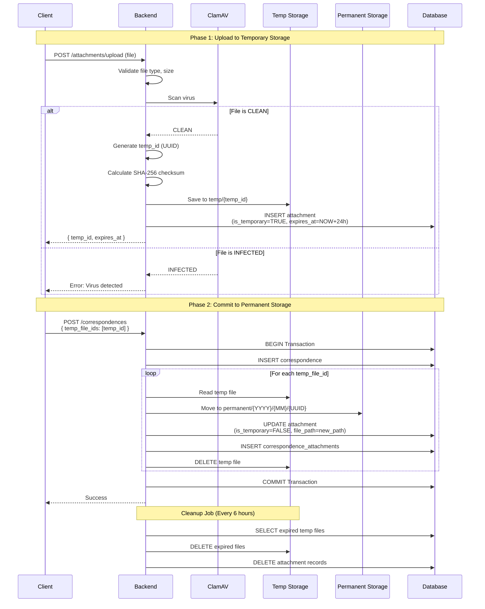

# ADR-003: Two-Phase File Storage Approach

**Status:** Accepted
**Date:** 2025-11-30
**Decision Makers:** Development Team, System Architect
**Related Documents:**

- [System Architecture](../02-architecture/02-01-system-architecture.md)
- [File Handling Requirements](../01-requirements/01-03.10-file-handling.md)

---

## Context and Problem Statement

LCBP3-DMS ต้องจัดการ File Uploads สำหรับ Attachments ของเอกสาร (PDF, DWG, DOCX, etc.) โดยต้องรับมือกับปัญหา:

1. **Orphan Files:** User อัพโหลดไฟล์แล้วไม่ Submit Form → ไฟล์ค้างใน Storage
2. **Transaction Integrity:** ถ้า Database Transaction Rollback → ไฟล์ยังอยู่ใน Storage
3. **Virus Scanning:** ต้อง Scan ไฟล์ก่อน Save
4. **File Validation:** ตรวจสอบ Type, Size, Checksum
5. **Storage Organization:** จัดเก็บไฟล์อย่างเป็นระเบียบ

### Key Challenges

- **Orphan File Problem:** ไฟล์ที่ไม่เคยถูก Link กับ Document
- **Data Consistency:** ต้อง Sync กับ Database Transaction
- **Performance:** Upload ต้องเร็ว (ไม่ Block Form Submission)
- **Security:** ป้องกัน Malicious Files
- **Storage Management:** จำกัด QNAP Storage Space

---

## Decision Drivers

- **Data Integrity:** File และ Database Record ต้อง Consistent
- **Security:** ป้องกัน Virus และ Malicious Files
- **User Experience:** Upload ต้องรวดเร็ว ไม่ Block UI
- **Storage Efficiency:** ไม่เก็บไฟล์ที่ไม่ใช้
- **Auditability:** ติดตามประวัติ File Operations

---

## Considered Options

### Option 1: Direct Upload to Permanent Storage

**แนวทาง:** อัพโหลดไฟล์ไปยัง Permanent Storage ทันที

**Pros:**

- ✅ Simple implementation
- ✅ Fast upload (one-step process)
- ✅ No intermediate storage

**Cons:**

- ❌ Orphan files ถ้า user ไม่ submit form
- ❌ ยากต่อการ Rollback ถ้า Transaction fail
- ❌ ต้อง Manual cleanup orphan files
- ❌ Security risk (file available before validation)

### Option 2: Upload after Form Submission

**แนวทาง:** Upload ไฟล์หลังจาก Submit Form

**Pros:**

- ✅ No orphan files
- ✅ Guaranteed consistency

**Cons:**

- ❌ Slow form submission (wait for upload)
- ❌ Poor UX (user waits for all files to upload)
- ❌ Transaction timeout risk (large files)
- ❌ ไม่ Support progress indication สำหรับแต่ละไฟล์

### Option 3: **Two-Phase Storage (Temp → Permanent)** ⭐ (Selected)

**แนวทาง:** Upload ไปยัง Temporary Storage ก่อน → Commit เมื่อ Submit Form สำเร็จ

**Pros:**

- ✅ **Fast Upload:** User upload ได้เลย ไม่ต้องรอ Submit
- ✅ **No Orphan Files:** Temp files cleanup automatically
- ✅ **Transaction Safe:** Move to permanent only on commit
- ✅ **Better UX:** Show progress per file
- ✅ **Security:** Scan files before entering system
- ✅ **Audit Trail:** Track all file operations

**Cons:**

- ❌ More complex implementation
- ❌ Need cleanup job for expired temp files
- ❌ Extra storage space (temp directory)

---

## Decision Outcome

**Chosen Option:** Option 3 - Two-Phase Storage (Temp → Permanent)

### Rationale

เลือก Two-Phase Storage เนื่องจาก:

1. **Better User Experience:** Upload ไว ไม่ Block Form Submission
2. **Data Integrity:** Sync กับ Database Transaction ได้ดี
3. **No Orphan Files:** Auto-cleanup ไฟล์ที่ไม่ใช้
4. **Security:** Scan และ Validate ก่อน Commit
5. **Scalability:** รองรับ Large Files และ Multiple Files

---

## Implementation Details

### Database Schema

```sql
CREATE TABLE attachments (
  id INT PRIMARY KEY AUTO_INCREMENT,
  original_filename VARCHAR(255) NOT NULL,
  stored_filename VARCHAR(255) NOT NULL,  -- UUID-based
  file_path VARCHAR(500) NOT NULL,
  mime_type VARCHAR(100) NOT NULL,
  file_size INT NOT NULL,
  checksum VARCHAR(64) NULL,  -- SHA-256

  -- Two-Phase Fields
  is_temporary BOOLEAN DEFAULT TRUE,
  temp_id VARCHAR(100) NULL,  -- UUID for temp reference
  expires_at DATETIME NULL,   -- Temp file expiration

  uploaded_by_user_id INT NOT NULL,
  created_at TIMESTAMP DEFAULT CURRENT_TIMESTAMP,

  FOREIGN KEY (uploaded_by_user_id) REFERENCES users(user_id),
  INDEX idx_temp_files (is_temporary, expires_at)
);
```

### Two-Phase Flow



### NestJS Service Implementation

```typescript
// file-storage.service.ts
import { Injectable } from '@nestjs/common';
import { ConfigService } from '@nestjs/config';
import { createHash } from 'crypto';
import * as fs from 'fs-extra';
import * as path from 'path';
import { v4 as uuidv4 } from 'uuid';

@Injectable()
export class FileStorageService {
  private readonly TEMP_DIR: string;
  private readonly PERMANENT_DIR: string;
  private readonly TEMP_EXPIRY_HOURS = 24;

  constructor(private config: ConfigService) {
    this.TEMP_DIR = this.config.get('STORAGE_PATH') + '/temp';
    this.PERMANENT_DIR = this.config.get('STORAGE_PATH') + '/permanent';
  }

  // Phase 1: Upload to Temporary
  async uploadToTemp(file: Express.Multer.File): Promise<UploadResult> {
    // 1. Validate file
    this.validateFile(file);

    // 2. Virus scan
    await this.virusScan(file);

    // 3. Generate temp ID
    const tempId = uuidv4();
    const storedFilename = `${tempId}_${file.originalname}`;
    const tempPath = path.join(this.TEMP_DIR, storedFilename);

    // 4. Calculate checksum
    const checksum = await this.calculateChecksum(file.buffer);

    // 5. Save to temp directory
    await fs.writeFile(tempPath, file.buffer);

    // 6. Create attachment record
    const attachment = await this.attachmentRepo.save({
      original_filename: file.originalname,
      stored_filename: storedFilename,
      file_path: tempPath,
      mime_type: file.mimetype,
      file_size: file.size,
      checksum,
      is_temporary: true,
      temp_id: tempId,
      expires_at: new Date(Date.now() + this.TEMP_EXPIRY_HOURS * 3600 * 1000),
      uploaded_by_user_id: this.currentUserId,
    });

    return {
      temp_id: tempId,
      expires_at: attachment.expires_at,
      filename: file.originalname,
      size: file.size,
    };
  }

  // Phase 2: Commit to Permanent (within Transaction)
  async commitFiles(
    tempIds: string[],
    entityId: number,
    entityType: string,
    manager: EntityManager
  ): Promise<Attachment[]> {
    const attachments = [];

    for (const tempId of tempIds) {
      // 1. Get temp attachment
      const tempAttachment = await manager.findOne(Attachment, {
        where: { temp_id: tempId, is_temporary: true },
      });

      if (!tempAttachment) {
        throw new Error(`Temporary file not found: ${tempId}`);
      }

      // 2. Check expiration
      if (tempAttachment.expires_at < new Date()) {
        throw new Error(`Temporary file expired: ${tempId}`);
      }

      // 3. Generate permanent path
      const now = new Date();
      const year = now.getFullYear();
      const month = (now.getMonth() + 1).toString().padStart(2, '0');
      const permanentDir = path.join(
        this.PERMANENT_DIR,
        year.toString(),
        month
      );
      await fs.ensureDir(permanentDir);

      const permanentFilename = `${uuidv4()}_${
        tempAttachment.original_filename
      }`;
      const permanentPath = path.join(permanentDir, permanentFilename);

      // 4. Move file
      await fs.move(tempAttachment.file_path, permanentPath);

      // 5. Update attachment record
      await manager.update(
        Attachment,
        { id: tempAttachment.id },
        {
          file_path: permanentPath,
          stored_filename: permanentFilename,
          is_temporary: false,
          temp_id: null,
          expires_at: null,
        }
      );

      attachments.push(tempAttachment);
    }

    return attachments;
  }

  // Cleanup Job (Cron)
  @Cron('0 */6 * * *') // Every 6 hours
  async cleanupExpiredFiles(): Promise<void> {
    const expiredFiles = await this.attachmentRepo.find({
      where: {
        is_temporary: true,
        expires_at: LessThan(new Date()),
      },
    });

    for (const file of expiredFiles) {
      try {
        // Delete physical file
        await fs.remove(file.file_path);

        // Delete DB record
        await this.attachmentRepo.remove(file);

        this.logger.log(`Cleaned up expired file: ${file.temp_id}`);
      } catch (error) {
        this.logger.error(`Failed to cleanup file: ${file.temp_id}`, error);
      }
    }
  }

  private async virusScan(file: Express.Multer.File): Promise<void> {
    // ClamAV integration
    const scanner = await this.clamAV.scan(file.buffer);
    if (scanner.isInfected) {
      throw new BadRequestException('Virus detected in file');
    }
  }

  private validateFile(file: Express.Multer.File): void {
    const allowedTypes = [
      'application/pdf',
      'application/vnd.openxmlformats-officedocument.wordprocessingml.document',
    ];
    const maxSize = 50 * 1024 * 1024; // 50MB

    if (!allowedTypes.includes(file.mimetype)) {
      throw new BadRequestException('Invalid file type');
    }

    if (file.size > maxSize) {
      throw new BadRequestException('File too large (max 50MB)');
    }
  }

  private async calculateChecksum(buffer: Buffer): Promise<string> {
    return createHash('sha256').update(buffer).digest('hex');
  }
}
```

### Controller Example

```typescript
@Controller('attachments')
export class AttachmentController {
  // Phase 1: Upload
  @Post('upload')
  @UseInterceptors(FileInterceptor('file'))
  async upload(@UploadedFile() file: Express.Multer.File) {
    return this.fileStorage.uploadToTemp(file);
  }
}

@Controller('correspondences')
export class CorrespondenceController {
  // Phase 2: Create with attachments
  @Post()
  async create(@Body() dto: CreateCorrespondenceDto) {
    return this.dataSource.transaction(async (manager) => {
      // 1. Create correspondence
      const correspondence = await manager.save(Correspondence, {
        title: dto.title,
        project_id: dto.project_id,
        // ...
      });

      // 2. Commit files (within transaction)
      if (dto.temp_file_ids?.length > 0) {
        await this.fileStorage.commitFiles(
          dto.temp_file_ids,
          correspondence.id,
          'correspondence',
          manager
        );
      }

      return correspondence;
    });
  }
}
```

---

## Consequences

### Positive

1. ✅ **Fast Upload UX:** User upload แบบ Async ก่อน Submit
2. ✅ **No Orphan Files:** Auto-cleanup ไฟล์ที่หมดอายุ
3. ✅ **Transaction Safe:** Rollback ได้สมบูรณ์
4. ✅ **Security:** Virus scan ก่อน Commit
5. ✅ **Audit Trail:** ติดตาม Upload และ Commit operations
6. ✅ **Storage Organization:** จัดเก็บเป็น YYYY/MM structure

### Negative

1. ❌ **Complexity:** ต้อง Implement 2 phases
2. ❌ **Extra Storage:** ต้องมี Temp directory
3. ❌ **Cleanup Job:** ต้องรัน Cron job
4. ❌ **Edge Cases:** Handle expired files, missing temp files

### Mitigation Strategies

- **Complexity:** Encapsulate ใน `FileStorageService`
- **Storage:** Monitor และ Alert ถ้า Temp directory ใหญ่เกินไป
- **Cleanup:** Run Cron ทุก 6 ชั่วโมง + Alert ถ้า Fail
- **Edge Cases:** Proper error handling และ logging

---

## Security Considerations

### File Validation

1. **Type Validation:**

   - Check MIME type
   - Verify Magic Numbers (ไม่ใช่แค่ extension)

2. **Size Validation:**

   - Max 50MB per file
   - Total max 500MB per form submission

3. **Virus Scanning:**

   - ClamAV integration
   - Scan before saving to temp

4. **Checksum:**
   - SHA-256 for integrity verification
   - Detect file tampering

---

## Performance Considerations

### Upload Optimization

- **Streaming:** Use multipart/form-data streaming
- **Parallel Uploads:** Client upload multiple files กรณี
- **Progress Indication:** Return upload progress for large files
- **Chunk Upload:** Support resumable uploads (future)

### Storage Optimization

- **Compression:** Consider compressing certain file types
- **Deduplication:** Check checksum before storing (future)
- **CDN:** Consider CDN for frequently accessed files (future)

---

## Compliance

เป็นไปตาม:

- [Backend Plan Section 4.2.1](../../docs/2_Backend_Plan_V1_4_5.md) - FileStorageService
- [Requirements 3.10](../01-requirements/01-03.10-file-handling.md) - File Handling
- [System Architecture Section 5.2](../02-architecture/02-01-system-architecture.md) - File Upload Flow

---

## Related ADRs

- [ADR-006: Security Best Practices](./ADR-006-security-best-practices.md) - Virus scanning และ file validation

---

## References

- [ClamAV Documentation](https://docs.clamav.net/)
- [Multer Middleware](https://github.com/expressjs/multer)
- [File Upload Best Practices](https://cheatsheetseries.owasp.org/cheatsheets/File_Upload_Cheat_Sheet.html)
