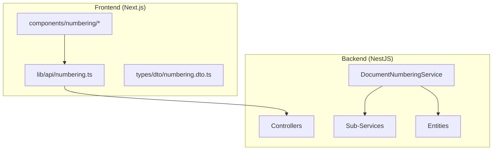
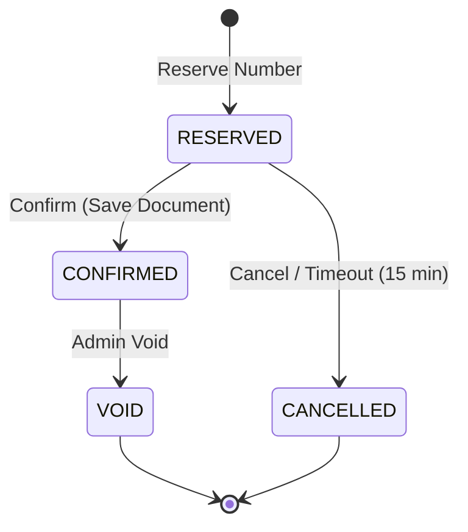
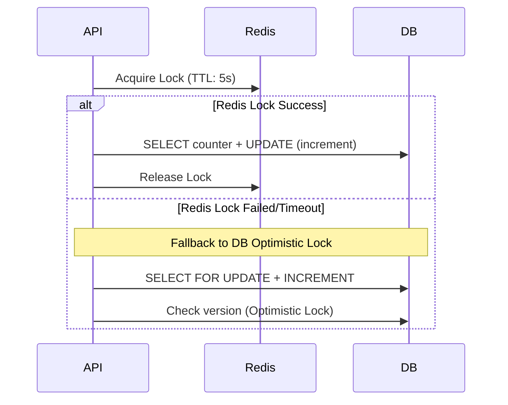
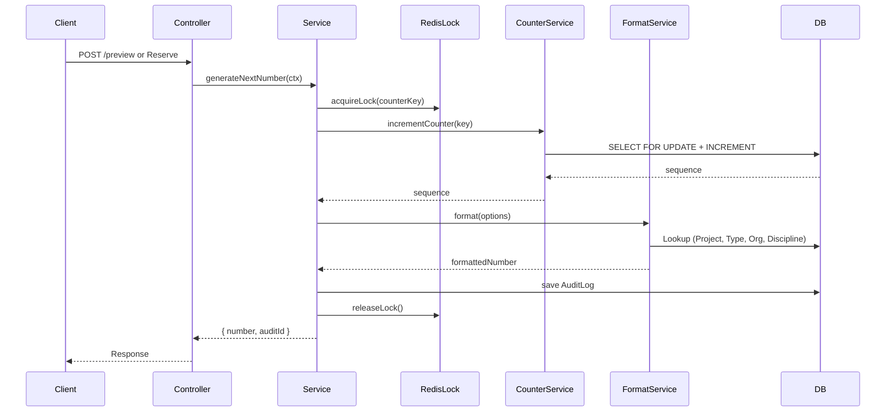

# 📋 Document Numbering System Summary

> **Version:** v1.7.0
> **Last Updated:** 2025-12-24
> **Status:** Implemented (with known build issues)

---

## 📊 Architecture Overview

ระบบ Document Numbering ใช้สำหรับสร้างเลขที่เอกสารอัตโนมัติ โดยมี **Reserve-Confirm Pattern** และ **Two-Phase Locking** (Redis + DB Optimistic Lock) เพื่อป้องกัน Race Conditions



---

## 📁 Backend Structure

### Module Location
`backend/src/modules/document-numbering/`

| Directory      | Files | Description                                                                         |
| -------------- | ----- | ----------------------------------------------------------------------------------- |
| `controllers/` | 3     | Public, Admin, Metrics Controllers                                                  |
| `services/`    | 8     | Main + Counter, Reservation, Format, Lock, Template, Audit, Metrics, ManualOverride |
| `entities/`    | 5     | Format, Counter, Reservation, Audit, Error                                          |
| `dto/`         | 5     | Preview, Reserve, ConfirmReservation, CounterKey, ManualOverride                    |
| `interfaces/`  | 1     | GenerateNumberContext                                                               |

### Key Services

| Service                        | Responsibility                                                       |
| ------------------------------ | -------------------------------------------------------------------- |
| `DocumentNumberingService`     | Main orchestrator (generateNextNumber, reserveNumber, previewNumber) |
| `CounterService`               | Increment counter with Optimistic Lock                               |
| `ReservationService`           | Reserve-Confirm pattern handling                                     |
| `FormatService`                | Token replacement & format resolution                                |
| `DocumentNumberingLockService` | Redis distributed lock (Redlock)                                     |
| `ManualOverrideService`        | Admin counter override                                               |
| `AuditService`                 | Audit logging                                                        |
| `MetricsService`               | Prometheus metrics                                                   |

---

## 📁 Frontend Structure

### Files

| Path                                         | Description                    |
| -------------------------------------------- | ------------------------------ |
| `lib/api/numbering.ts`                       | API client + Types (335 lines) |
| `lib/services/document-numbering.service.ts` | Service wrapper                |
| `types/dto/numbering.dto.ts`                 | DTOs for forms                 |
| `types/numbering.ts`                         | Type re-exports                |

### Components (`components/numbering/`)

| Component                  | Description                 |
| -------------------------- | --------------------------- |
| `template-editor.tsx`      | Editor for format templates |
| `template-tester.tsx`      | Test number generation      |
| `sequence-viewer.tsx`      | View counter sequences      |
| `metrics-dashboard.tsx`    | Audit/Error logs dashboard  |
| `manual-override-form.tsx` | Admin counter override      |
| `void-replace-form.tsx`    | Void & Replace number       |
| `cancel-number-form.tsx`   | Cancel/Skip a number        |
| `bulk-import-form.tsx`     | Bulk import counters        |
| `audit-logs-table.tsx`     | Audit logs table            |

### Admin Pages
- `app/(admin)/admin/numbering/` - Template management
- `app/(admin)/admin/system-logs/numbering/` - System logs

---

## 💾 Database Schema (v1.7.0)

### 5 Tables

| Table                          | Purpose                   | Key Feature                                 |
| ------------------------------ | ------------------------- | ------------------------------------------- |
| `document_number_formats`      | Template รูปแบบเลขที่เอกสาร  | Unique per (project, correspondence_type)   |
| `document_number_counters`     | Running Number Counter    | **8-Column Composite PK** + Optimistic Lock |
| `document_number_audit`        | Audit Trail สำหรับทุกการสร้าง | เก็บ ≥ 7 ปี                                   |
| `document_number_errors`       | Error Log                 | 5 Error Types                               |
| `document_number_reservations` | **Two-Phase Commit**      | Reserve → Confirm Pattern                   |

---

## 🔑 Counter Composite Primary Key (8 Columns)

```sql
PRIMARY KEY (
  project_id,
  originator_organization_id,
  recipient_organization_id,    -- 0 = no recipient (RFA)
  correspondence_type_id,
  sub_type_id,                  -- 0 = ไม่ระบุ (for TRANSMITTAL)
  rfa_type_id,                  -- 0 = ไม่ใช่ RFA
  discipline_id,                -- 0 = ไม่ระบุ
  reset_scope                   -- 'YEAR_2024', 'NONE', etc.
)
```

### Reset Scope Values

| Value           | Description                      |
| --------------- | -------------------------------- |
| `YEAR_XXXX`     | Reset ทุกปี เช่น `YEAR_2024`        |
| `MONTH_XXXX_XX` | Reset ทุกเดือน เช่น `MONTH_2024_01` |
| `CONTRACT_XXXX` | Reset ต่อสัญญา                     |
| `NONE`          | ไม่ Reset                         |

### Constraints

```sql
CONSTRAINT chk_last_number_positive CHECK (last_number >= 0)
CONSTRAINT chk_reset_scope_format CHECK (
  reset_scope IN ('NONE')
  OR reset_scope LIKE 'YEAR_%'
  OR reset_scope LIKE 'MONTH_%'
  OR reset_scope LIKE 'CONTRACT_%'
)
```

---

## 📜 Business Rules

### 1️⃣ Number Generation Rules

| Rule                          | Description                                          |
| ----------------------------- | ---------------------------------------------------- |
| **Uniqueness**                | เลขที่เอกสารห้ามซ้ำกันภายใน Project                        |
| **Sequence Reset**            | Reset ตาม `reset_scope` (ปกติ Reset ต่อปี)              |
| **Idempotency**               | ใช้ `Idempotency-Key` header ป้องกันการสร้างซ้ำ            |
| **Race Condition Prevention** | Redis Lock (Primary) + DB Optimistic Lock (Fallback) |
| **Format Fallback**           | ใช้ Default Format ถ้าไม่มี Specific Format              |

### 2️⃣ Two-Phase Commit (Reserve → Confirm)



| Status      | Description                         |
| ----------- | ----------------------------------- |
| `RESERVED`  | จองแล้ว รอ Confirm (หมดอายุใน 15 นาที) |
| `CONFIRMED` | ยืนยันแล้ว ใช้งานจริง                    |
| `CANCELLED` | ยกเลิก (User/System/Timeout)         |
| `VOID`      | Admin Void (ยกเลิกเลขที่หลัง Confirm)   |

### 3️⃣ Format Template Tokens

| Token          | Example Value | Description                  |
| -------------- | ------------- | ---------------------------- |
| `{PROJECT}`    | `LCBP3`       | Project Code                 |
| `{ORG}`        | `NAP`         | Originator Organization Code |
| `{RECIPIENT}`  | `PAT`         | Recipient Organization Code  |
| `{TYPE}`       | `LET`         | Correspondence Type Code     |
| `{DISCIPLINE}` | `STR`         | Discipline Code              |
| `{SEQ:N}`      | `0001`        | Sequence padded to N digits  |
| `{YEAR}`       | `2025`        | 4-digit CE Year              |
| `{YEAR:BE}`    | `2568`        | 4-digit Buddhist Era Year    |
| `{REV}`        | `0`           | Revision Number              |

### Example Format

```
Template: {ORG}-{RECIPIENT}-{TYPE}-{YEAR:BE}-{SEQ:4}
Result:   NAP-PAT-LET-67-0001
```

### 4️⃣ Format Resolution Priority

1. **Specific Format**: project_id + correspondence_type_id
2. **Default Format**: project_id + correspondence_type_id = NULL
3. **Fallback**: `{ORG}-{RECIPIENT}-{SEQ:4}-{YEAR:BE}`

---

## 🛡️ Concurrency Control Strategy



| Strategy               | Use Case                                    |
| ---------------------- | ------------------------------------------- |
| **Redis Redlock**      | Primary - Distributed Lock across instances |
| **DB Optimistic Lock** | Fallback - When Redis down/timeout          |
| **Version Column**     | Prevent concurrent updates                  |

---

## 🔄 Generation Flow



---

## 🔌 API Endpoints

### Public (`/document-numbering`)

| Method | Endpoint        | Permission               | Description                 |
| ------ | --------------- | ------------------------ | --------------------------- |
| POST   | `/preview`      | `correspondence.read`    | Preview เลขที่ (ไม่ increment) |
| GET    | `/sequences`    | `correspondence.read`    | ดู Counter ทั้งหมด             |
| GET    | `/logs/audit`   | `system.view_logs`       | Audit Logs                  |
| GET    | `/logs/errors`  | `system.view_logs`       | Error Logs                  |
| PATCH  | `/counters/:id` | `system.manage_settings` | Update Counter (Deprecated) |

### Admin (`/admin/document-numbering`)

| Method | Endpoint                 | Description                 |
| ------ | ------------------------ | --------------------------- |
| GET    | `/templates`             | ดู Templates ทั้งหมด           |
| GET    | `/templates?projectId=X` | ดู Templates ตาม Project     |
| POST   | `/templates`             | สร้าง/แก้ไข Template          |
| DELETE | `/templates/:id`         | ลบ Template                 |
| GET    | `/metrics`               | Audit + Error Logs combined |
| POST   | `/manual-override`       | Override Counter Value      |
| POST   | `/void-and-replace`      | Void + สร้างเลขใหม่           |
| POST   | `/cancel`                | ยกเลิกเลขที่                   |
| POST   | `/bulk-import`           | Import Counters จาก Legacy  |

---

## 📈 Audit & Monitoring

### Audit Log Operations

| Operation         | Description        |
| ----------------- | ------------------ |
| `RESERVE`         | จองเลขที่            |
| `CONFIRM`         | ยืนยันการใช้เลขที่      |
| `MANUAL_OVERRIDE` | Admin แก้ไข Counter |
| `VOID_REPLACE`    | Void และสร้างใหม่    |
| `CANCEL`          | ยกเลิกเลขที่          |

### Audit Log Fields

| Field               | Description                   |
| ------------------- | ----------------------------- |
| `counter_key`       | JSON 8 fields (Composite Key) |
| `reservation_token` | UUID v4 สำหรับ Reserve-Confirm  |
| `idempotency_key`   | Request Idempotency Key       |
| `template_used`     | Format Template ที่ใช้           |
| `retry_count`       | จำนวนครั้งที่ retry                |
| `lock_wait_ms`      | เวลารอ Redis lock (ms)        |
| `total_duration_ms` | เวลารวมทั้งหมด (ms)             |
| `fallback_used`     | NONE / DB_LOCK / RETRY        |

### Error Types

| Type               | Description                     |
| ------------------ | ------------------------------- |
| `LOCK_TIMEOUT`     | Redis lock หมดเวลา              |
| `VERSION_CONFLICT` | Optimistic lock fail            |
| `DB_ERROR`         | Database error                  |
| `REDIS_ERROR`      | Redis connection error          |
| `VALIDATION_ERROR` | Template/Input validation error |

### Prometheus Metrics

| Metric                           | Type      | Description                   |
| -------------------------------- | --------- | ----------------------------- |
| `numbering_sequences_total`      | Counter   | Total sequences generated     |
| `numbering_sequence_utilization` | Gauge     | Utilization of sequence space |
| `numbering_lock_wait_seconds`    | Histogram | Time waiting for locks        |
| `numbering_lock_failures_total`  | Counter   | Lock acquisition failures     |

---

## 🔐 Permissions

| Permission               | Description                                   |
| ------------------------ | --------------------------------------------- |
| `correspondence.read`    | Preview, View Sequences                       |
| `system.view_logs`       | View Audit/Error Logs                         |
| `system.manage_settings` | Template CRUD, Override, Void, Cancel, Import |

---

## ⚠️ Known Issues (Current Build)

### TypeScript Errors

1. **DTO Field Mismatch**
   - `PreviewNumberDto.originatorId` vs Service expects `originatorOrganizationId`

2. **Missing Properties in PreviewNumberDto**
   - `correspondenceTypeId` (used as `typeId`)
   - `customTokens`

3. **TypeScript Initializers**
   - DTOs need `!` or default values for strict mode

### Files Needing Fix

- `dto/preview-number.dto.ts`
- `dto/reserve-number.dto.ts`
- `dto/confirm-reservation.dto.ts`
- `dto/counter-key.dto.ts`
- `entities/document-number-format.entity.ts`
- `entities/document-number-error.entity.ts`
- `services/document-numbering.service.ts`

---

## 📚 Related Documentation

- [specs/01-requirements/03.11-document-numbering.md](../specs/01-requirements/03.11-document-numbering.md)
- [specs/03-implementation/document-numbering.md](../specs/03-implementation/document-numbering.md)
- [specs/07-database/data-dictionary-v1.7.0.md](../specs/07-database/data-dictionary-v1.7.0.md)
- [specs/07-database/lcbp3-v1.7.0-schema.sql](../specs/07-database/lcbp3-v1.7.0-schema.sql)

---

## 📝 Changelog

### v1.7.0
- Changed `document_number_counters` PK from 5 to **8 columns**
- Added `document_number_reservations` table for Two-Phase Commit
- Added `reset_scope` field (replaces `current_year`)
- Enhanced `document_number_audit` with operation tracking
- Added `idempotency_key` support

### v1.5.1
- Initial implementation
- Basic format templating
- Counter management

---

**End of Document**
