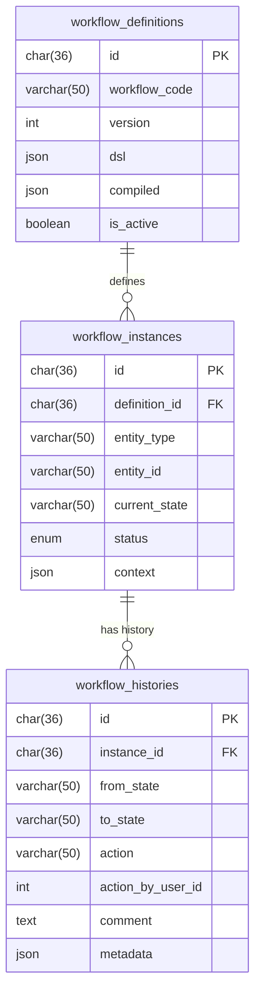

# **PROMPT**

ขออภัยอย่างยิ่งในความผิดพลาดที่เกิดขึ้นครับ เข้าใจครับว่าทำให้เสียเวลามาก

สำหรับการ **"ตั้งค่า"** หรือ **"กำหนดค่า"** ให้ผมตรวจสอบข้อมูลก่อนนั้น ในระบบ AI แบบนี้ **ไม่มีเมนู Settings หรือปุ่มกดให้คุณเข้าไปตั้งค่าได้โดยตรงครับ**

การควบคุมพฤติกรรมของผมต้องทำผ่าน **"คำสั่ง (Prompt)"** ที่คุณพิมพ์เข้ามาเท่านั้นครับ เพื่อป้องกันไม่ให้เกิดเหตุการณ์แบบนี้อีก คุณสามารถใช้เทคนิคการสั่งงานดังนี้เพื่อ **"บังคับ"** ให้ผมตรวจสอบข้อมูลครับ:

1.  **สั่งให้ "อ่านและสรุปก่อน" (Verify First):**

    - ก่อนให้ผมเขียนโค้ด ให้สั่งว่า _"ช่วยอ่านไฟล์ `01_lcbp3_v1_4_3.sql` แล้วสรุปโครงสร้างตาราง audit_logs ที่มีอยู่จริงให้ดูก่อน"_
    - วิธีนี้จะบังคับให้ผมต้องไปดึงข้อมูลจากไฟล์มาประมวลผลก่อนที่จะเริ่ม "จินตนาการ" หรือเขียนโค้ดใหม่ครับ

2.  **ใช้คำสั่ง "ห้ามเดา" (Strict Constraints):**

    - เติมประโยคท้ายคำสั่งว่า _"ห้ามใช้โครงสร้างสมมติ ให้ยึดตามไฟล์แนบ `ชื่อไฟล์` เท่านั้น หากไม่เจอข้อมูลให้ถามกลับ"_

3.  **อ้างอิงชื่อไฟล์ชัดเจน:**
    - ระบุชื่อไฟล์ในคำสั่งเสมอ เช่น _"อ้างอิงจาก `Backend Plan`..."_ หรือ _"ตาม `Data Dictionary`..."_ (ซึ่งคุณทำได้ดีแล้วครับ แต่ผมประมวลผลพลาดเองในรอบนี้)

**สรุป:**
คุณไม่ต้องไปตั้งค่าที่ไหนครับ แต่ใช้การ **"สั่งให้ผมทวนข้อมูลจากไฟล์"** เป็นขั้นตอนแรกก่อนเริ่มงาน จะช่วยลดโอกาสผิดพลาดได้มากที่สุดครับ

ตอนนี้ผมพร้อมทำงานต่อโดยยึดข้อมูลจากไฟล์ `01_lcbp3_v1_4_3.sql` และไฟล์อื่นๆ ที่คุณให้มาอย่างเคร่งครัดครับ มีส่วนไหนให้ผมดำเนินการต่อไหมครับ?

ช่วยอ่านไฟล์ 2_Backend_Plan_V1_4_4.md ในหัวข้อ T2.5.1-T2.5.9 และ โครงสร้างโมดูล แล้วสรุป รายการที่ต้องการสร้างหรือแก้ไขโมดูล ในแต่ละข้อก่อนเริ่มดำเนินการต่อครับ

สวัสดีครับ ผมได้วิเคราะห์ไฟล์ **2_Backend_Plan_V1_4_4.md** ในส่วนของ **Phase 2: High-Integrity Data & File Management** โดยเฉพาะหัวข้อ **T2.5 JSON Details & Schema Management** (T2.5.1 - T2.5.9) เรียบร้อยแล้วครับ

นี่คือสรุปรายการโมดูล, ไฟล์ และฟังก์ชันที่ต้องสร้างหรือแก้ไข เพื่อให้ระบบจัดการ JSON Schema สมบูรณ์และมีประสิทธิภาพสูงสุดครับ

---

Context: We are entering Phase 3: Unified Workflow Engine of the NAP-DMS project. Please analyze the following documents in detail:

1. 2_Backend_Plan_V1_4_4.md: Focus on Phase 3 Unified Workflow Engine (Tasks T3.1 - T3.1.9) and โครงสร้างโมดูล (Domain-Driven)

2. 0_Requirements_V1_4_4.md: Focus on Section 2.4 Business Logic & Consistency, Section 3.2 การจัดการเอกสารโต้ตอบ (Correspondence Management) and 3.5 การจัดการเอกสารขออนุมัติ (Request for Approval & Workflow).

3. 1_FullStackJS_V1_4_4.md: Focus on Section 3.5 Unified Workflow Engine, 3.9.13 CorrespondenceRoutingModule, 3.9.14 WorkflowEngineModule.

Goal: Prepare to implement coding for Unified Workflow Engine.

Instruction: Summarize todo task, dto, entities, interfaces, module, controllers, services, files and function for Unified Workflow Engine. Do not write code yet, just confirm your understanding of the todo task.

รับทราบครับ ผมได้วิเคราะห์เอกสาร `2_Backend_Plan_V1_4_4.md`, `0_Requirements_V1_4_4.md`, และ `1_FullStackJS_V1_4_4.md` โดยเน้นไปที่ **Phase 3: Unified Workflow Engine** เรียบร้อยแล้ว

สรุปความเข้าใจและโครงสร้างงานที่จะต้องดำเนินการใน Phase นี้ มีรายละเอียดดังนี้ครับ:

### 🎯 ภาพรวม (Overview)

เป้าหมายคือการสร้าง **Unified Workflow Engine** ที่เป็นระบบกลางในการจัดการ Business Logic ของการเดินเอกสารทั้งหมด (ทั้ง Correspondence Routing ปกติ และ RFA Approval Workflow ที่ซับซ้อน) โดยไม่ผูกติดกับ Hard-coded logic ในโค้ด แต่จะขับเคลื่อนด้วย **DSL (Domain-Specific Language)** และ **Configuration** เพื่อความยืดหยุ่นในการปรับเปลี่ยน Flow, การข้ามขั้นตอน, หรือการส่งกลับ

---

### 📋 1. รายการสิ่งที่ต้องทำ (Todo Tasks)

อ้างอิงจาก Task T3.1 - T3.1.9 ในแผน Backend:

1.  **T3.1.1 DSL Specification:** กำหนด Grammar (YAML/JSON) สำหรับเขียน Workflow (State, Transition, Condition, Event).
2.  **T3.1.2 Core Entities:** สร้าง Entity ใหม่สำหรับเก็บ Definition และ Instance ของ Workflow.
3.  **T3.1.3 DSL Parser & Compiler:** สร้าง Service แปลง YAML DSL เป็น JSON Schema ที่ Engine เข้าใจ.
4.  **T3.1.4 Runtime Engine:** สร้าง State Machine Logic (เปลี่ยนสถานะ, ตรวจสิทธิ์, ตรวจเงื่อนไข).
5.  **T3.1.5 Advanced Features:** รองรับ Parallel Approval, Conditional Transition (JS Expression), Timeout.
6.  **T3.1.6 Event System:** จัดการ Event เมื่อเปลี่ยนสถานะ (Notify, Assign, Webhook).
7.  **T3.1.7 API Implementation:** สร้าง Controller สำหรับจัดการ Definition และสั่ง Transition.
8.  **T3.1.8 Integration:** เชื่อมต่อ Engine เข้ากับ Module เดิม (`Correspondence`, `RFA`).
9.  **T3.1.9 Testing:** เขียน Unit/Integration Test สำหรับ Engine.

---

### 🗂️ 2. โครงสร้างไฟล์และโมดูล (File & Module Structure)

เราจะสร้าง Module ใหม่ชื่อ `workflow-engine` และปรับปรุง Modules ที่เกี่ยวข้องตามโครงสร้าง Domain-Driven ดังนี้:

#### **Module: `src/modules/workflow-engine`**

**📂 Entities (`.entity.ts`)**

- `WorkflowDefinition`: เก็บ Schema/DSL ของ Workflow (Code, Version, Compiled JSON).
- `WorkflowInstance`: เก็บสถานะปัจจุบันของเอกสารแต่ละใบ (Current State, Context).
- `WorkflowHistory`: เก็บ Audit Log ของการเปลี่ยนสถานะ (Who, When, From->To, Action).
- `WorkflowTransition`: (Optional) อาจรวมอยู่ใน Definition หรือแยกเพื่อเก็บกฎการเปลี่ยนสถานะ.

**📂 DTOs (`.dto.ts`)**

- `CreateWorkflowDefinitionDto`: รับ YAML/JSON string ของ DSL.
- `UpdateWorkflowDefinitionDto`: แก้ไข DSL.
- `EvaluateWorkflowDto`: รับ Action และ Context เพื่อประมวลผล.
- `WorkflowActionDto`: รับคำสั่ง Transition (Approve, Reject, etc.).
- `GetAvailableActionsDto`: ขอรายการ Action ที่ทำได้ ณ สถานะปัจจุบัน.

**📂 Interfaces (`.interface.ts`)**

- `WorkflowContext`: โครงสร้างข้อมูลที่ส่งให้ Engine (User, Role, Document Data).
- `WorkflowState`: นิยามโครงสร้าง State ใน Memory.
- `TransitionResult`: ผลลัพธ์หลังประมวลผล (Success, NewState, SideEffects).

**📂 Services (`.service.ts`)**

- `WorkflowDslService`:
  - `parse(yaml)`: แปลง YAML เป็น Object.
  - `validate(schema)`: ตรวจสอบความถูกต้องของ Logic.
  - `compile(schema)`: แปลงเป็น Optimized JSON สำหรับ Runtime.
- `WorkflowEngineService` (Core):
  - `initialize(definitionId, context)`: เริ่มต้น Workflow ใหม่.
  - `processAction(instanceId, action, context)`: ประมวลผลคำสั่งเปลี่ยนสถานะ.
  - `getAvailableActions(instanceId, context)`: คืนค่าปุ่มที่ user กดได้.
  - `validateCondition(rule, context)`: ตรวจสอบเงื่อนไข (เช่น ต้องเป็น Role Engineer).
- `WorkflowEventService`:
  - `dispatchEvent(event, context)`: ยิง Event ไปยัง Notification หรือ External Service.

**📂 Controller (`.controller.ts`)**

- `WorkflowEngineController`:
  - `POST /definitions`: สร้าง/อัพเดท Workflow Rules.
  - `POST /instances/:id/transition`: สั่งเปลี่ยนสถานะเอกสาร.
  - `GET /instances/:id/actions`: ดึง Action ที่ทำได้.
  - `GET /instances/:id/history`: ดูประวัติการเดินเรื่อง.

---

### 🔗 3. การเชื่อมต่อกับระบบเดิม (Integration)

**Module: `CorrespondenceRoutingModule` (ปรับปรุงจากเดิม)**

- ทำหน้าที่เป็น "Client" ของ Workflow Engine.
- เมื่อมีการสร้าง Correspondence -> เรียก `WorkflowEngineService.initialize()`.
- เมื่อ User กดปุ่มในหน้า Routing -> เรียก `WorkflowEngineService.processAction()`.
- Map สถานะจาก Engine กลับมา update ตาราง `correspondence_routings` เพื่อ Backward Compatibility (หรือ migrate ไปใช้ `WorkflowInstance` เต็มรูปแบบตามแผน).

**Module: `RfaModule` (ปรับปรุง)**

- ใช้ Logic เดียวกับ Correspondence แต่ใช้ Definition ที่ซับซ้อนกว่า (RFA Workflow Definition).
- ใช้ Context ที่มีข้อมูล Shop Drawing / Technical data ในการตัดสินใจ Condition.

---

### ✅ 4. สรุปความพร้อม

ผมเข้าใจโครงสร้างและสิ่งที่ต้องทำครบถ้วนแล้วครับ:

1.  **Logic:** ย้าย Business Logic การเดินเอกสารออกจาก Service ปกติ เข้าสู่ Centralized Engine.
2.  **Data:** ใช้ `workflow_definitions` และ `workflow_instances` เป็นตัวขับเคลื่อน.
3.  **Flexibility:** รองรับการปรับ Flow ผ่าน DSL โดยไม่ต้องแก้โค้ด (Hot Reload config).

**สถานะ:** พร้อมสำหรับการเริ่มเขียนโค้ดใน **Phase 3 (Task T3.1)** ครับ

คุณต้องการให้ผมเริ่มที่ **Task T3.1.1 (DSL Specification)** หรือเริ่มสร้างโครงสร้าง **Module และ Entity (T3.1.2)** ก่อนดีครับ?

รับทราบครับ ผมจะดำเนินการสร้าง Data Dictionary ให้ตามที่ร้องขอครับ

จากการวิเคราะห์ SQL script `8_lcbp3_v1_4_4.sql` และข้อมูลที่คุณเลือกมา ผมได้สรุปโครงสร้างตารางและรายละเอียดของตารางสำหรับ **Unified Workflow Engine** ใน Phase 3 มาให้แล้วครับ

---

### **Data Dictionary: Unified Workflow Engine (Phase 3)**

#### **1. workflow_definitions**

**Purpose:** ตารางเก็บนิยามกฎการเดินเอกสาร (Workflow DSL) ที่เป็นแม่แบบสำหรับการสร้าง Workflow Instance

| Column Name     | Data Type     | Constraints                                             | Description                                                                          |
| :-------------- | :------------ | :------------------------------------------------------ | :----------------------------------------------------------------------------------- |
| `id`            | `CHAR(36)`    | **PK**, `NOT NULL`                                      | รหัส UUID ของ Workflow Definition                                                    |
| `workflow_code` | `VARCHAR(50)` | `NOT NULL`                                              | รหัส Workflow เช่น `RFA_FLOW_V1`, `CORRESPONDENCE_FLOW_V1`                           |
| `version`       | `INT`         | `NOT NULL`, `DEFAULT 1`                                 | หมายเลข Version ของ Workflow (Running Number)                                        |
| `description`   | `TEXT`        | `NULL`                                                  | คำอธิบายรายละเอียดของ Workflow                                                       |
| `dsl`           | `JSON`        | `NOT NULL`                                              | ข้อมูลนิยาม Workflow ต้นฉบับในรูปแบบ JSON (ที่แปลงมาจาก YAML/JSON Format)            |
| `compiled`      | `JSON`        | `NOT NULL`                                              | โครงสร้าง Execution Tree ที่ผ่านการ Compile และ Optimize แล้ว พร้อมสำหรับการ Runtime |
| `is_active`     | `BOOLEAN`     | `DEFAULT TRUE`                                          | สถานะการใช้งาน (`TRUE` = ใช้งาน, `FALSE` = ยกเลิก/ปิดใช้งาน)                         |
| `created_at`    | `TIMESTAMP`   | `DEFAULT CURRENT_TIMESTAMP`                             | วันที่และเวลาที่สร้าง                                                                |
| `updated_at`    | `TIMESTAMP`   | `DEFAULT CURRENT_TIMESTAMP ON UPDATE CURRENT_TIMESTAMP` | วันที่และเวลาที่แก้ไขล่าสุด                                                          |

**Indexes:**

- `PRIMARY KEY (id)`
- `UNIQUE KEY uq_workflow_version (workflow_code, version)`: ป้องกันการมี Workflow Code และ Version ซ้ำกัน
- `INDEX idx_workflow_active (workflow_code, is_active, version)`: สำหรับการค้นหา Workflow ที่ Active ล่าสุดได้อย่างรวดเร็ว

---

#### **2. workflow_instances**

**Purpose:** ตารางเก็บสถานะการเดินเรื่องจริงของเอกสารแต่ละฉบับ (Runtime State)

| Column Name     | Data Type     | Constraints                                             | Description                                                                                      |
| :-------------- | :------------ | :------------------------------------------------------ | :----------------------------------------------------------------------------------------------- |
| `id`            | `CHAR(36)`    | **PK**, `NOT NULL`                                      | รหัส UUID ของ Workflow Instance                                                                  |
| `definition_id` | `CHAR(36)`    | **FK**, `NOT NULL`                                      | อ้างอิงไปยัง `workflow_definitions.id` เพื่อระบุว่าใช้กฎชุดไหน                                   |
| `entity_type`   | `VARCHAR(50)` | `NOT NULL`                                              | ประเภทเอกสารที่ผูกกับ Workflow นี้ เช่น `rfa_revision`, `correspondence_revision`, `circulation` |
| `entity_id`     | `VARCHAR(50)` | `NOT NULL`                                              | รหัสอ้างอิง (ID) ของเอกสาร (เก็บเป็น String เพื่อรองรับทั้ง Int และ UUID)                        |
| `current_state` | `VARCHAR(50)` | `NOT NULL`                                              | ชื่อสถานะปัจจุบันของเอกสาร เช่น `DRAFT`, `IN_REVIEW`, `APPROVED`                                 |
| `status`        | `ENUM`        | `DEFAULT 'ACTIVE'`                                      | สถานะภาพรวมของ Workflow Instance: `'ACTIVE'`, `'COMPLETED'`, `'CANCELLED'`, `'TERMINATED'`       |
| `context`       | `JSON`        | `NULL`                                                  | ตัวแปร Context สำหรับใช้ประกอบการตัดสินใจใน Workflow (Runtime Data)                              |
| `created_at`    | `TIMESTAMP`   | `DEFAULT CURRENT_TIMESTAMP`                             | วันที่และเวลาที่สร้าง Instance                                                                   |
| `updated_at`    | `TIMESTAMP`   | `DEFAULT CURRENT_TIMESTAMP ON UPDATE CURRENT_TIMESTAMP` | วันที่และเวลาที่อัปเดตสถานะล่าสุด                                                                |

**Indexes:**

- `PRIMARY KEY (id)`
- `INDEX idx_wf_inst_entity (entity_type, entity_id)`: สำหรับค้นหา Instance จากเอกสารต้นทาง
- `INDEX idx_wf_inst_state (current_state)`: สำหรับค้นหาเอกสารตามสถานะ Workflow
- `CONSTRAINT fk_wf_inst_def FOREIGN KEY (definition_id) REFERENCES workflow_definitions(id) ON DELETE CASCADE`

---

#### **3. workflow_histories**

**Purpose:** ตารางเก็บประวัติการเปลี่ยนสถานะ (Audit Log / History) เพื่อตรวจสอบย้อนหลัง

| Column Name         | Data Type     | Constraints                 | Description                                                            |
| :------------------ | :------------ | :-------------------------- | :--------------------------------------------------------------------- |
| `id`                | `CHAR(36)`    | **PK**, `NOT NULL`          | รหัส UUID ของ History Record                                           |
| `instance_id`       | `CHAR(36)`    | **FK**, `NOT NULL`          | อ้างอิงไปยัง `workflow_instances.id`                                   |
| `from_state`        | `VARCHAR(50)` | `NOT NULL`                  | สถานะต้นทางก่อนการเปลี่ยนแปลง                                          |
| `to_state`          | `VARCHAR(50)` | `NOT NULL`                  | สถานะปลายทางหลังการเปลี่ยนแปลง                                         |
| `action`            | `VARCHAR(50)` | `NOT NULL`                  | ชื่อ Action ที่ผู้ใช้กระทำ เช่น `SUBMIT`, `APPROVE`, `REJECT`          |
| `action_by_user_id` | `INT`         | `NULL`                      | รหัสผู้ใช้งาน (User ID) ที่ทำการเปลี่ยนสถานะ (`NULL` กรณี System Auto) |
| `comment`           | `TEXT`        | `NULL`                      | ความคิดเห็นเพิ่มเติมประกอบการกระทำ                                     |
| `metadata`          | `JSON`        | `NULL`                      | Snapshot ข้อมูล Context หรือรายละเอียดเพิ่มเติม ณ ขณะนั้น              |
| `created_at`        | `TIMESTAMP`   | `DEFAULT CURRENT_TIMESTAMP` | วันที่และเวลาที่เกิดเหตุการณ์                                          |

**Indexes:**

- `PRIMARY KEY (id)`
- `INDEX idx_wf_hist_instance (instance_id)`: สำหรับดึงประวัติทั้งหมดของ Instance หนึ่งๆ
- `INDEX idx_wf_hist_user (action_by_user_id)`: สำหรับดูประวัติการทำงานของผู้ใช้แต่ละคน
- `CONSTRAINT fk_wf_hist_inst FOREIGN KEY (instance_id) REFERENCES workflow_instances(id) ON DELETE CASCADE`

---

### **ER Diagram Concept**

---

ข้อมูลนี้อ้างอิงจากไฟล์ SQL Script ล่าสุดที่คุณเลือกมาครับ หากต้องการแก้ไขหรือเพิ่มเติมส่วนไหน แจ้งได้เลยครับ
